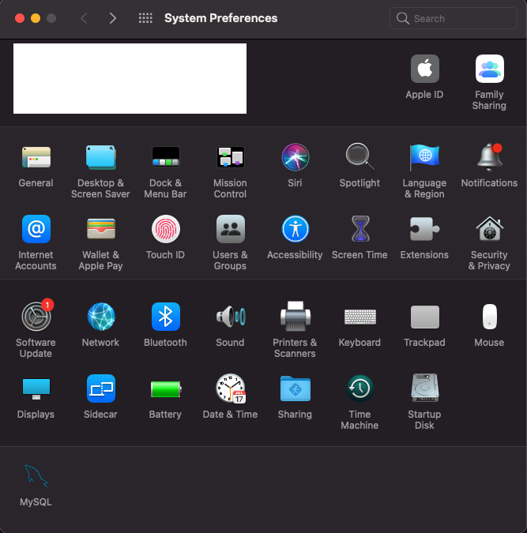
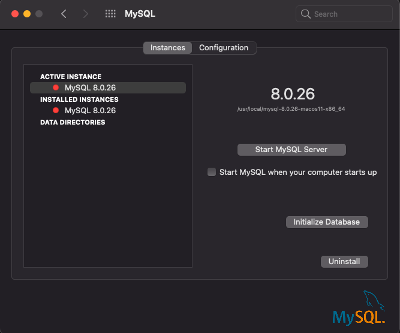
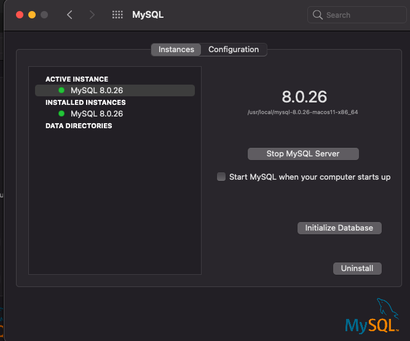

# MySQL Cheatsheet
During my time as a developer I have used countless technologies with their own set of configuration steps needed in order to use. That is why I have created this cheatsheet; to be able to use the technology without much need to rememeber how to set up.

## Step 1 - Open System Preferences
- At the bottom of the System Preferences GUI, there will be a MySQL icon. Double Click it.


## Step 2 - Click `Start MySQL Server`

Enter computer password
 - MySQL is an open source relational database management system (RDBMS) with a client-server model. RDBMS is a software or service used to create and manage databases based on a relational model.
 - Computers that install and run RDBMS software are called clients. Whenever they need to access data, they connect to the RDBMS server. That’s the “client-server” part
[source](https://www.hostinger.com/tutorials/what-is-mysql)


## Step 3 - Connect To MySQL server
- Create a new project folder and open the terminal.
- In the terminal run the command `mysql -u root -p `
  - MySQL will now ask for your MySQL password. Enter it.
```
brock@Brocks-MBP mysql_cheatsheet % mysql -u root -p      
Enter password: <ENTER PASSWORD HERE>
Welcome to the MySQL monitor.  Commands end with ; or \g.
Your MySQL connection id is 8
Server version: 8.0.26 MySQL Community Server - GPL
Copyright (c) 2000, 2021, Oracle and/or its affiliates.
Oracle is a registered trademark of Oracle Corporation and/or its
affiliates. Other names may be trademarks of their respective
owners.
Type 'help;' or '\h' for help. Type '\c' to clear the current input statement.
mysql> 
```
We now have a connection to MySQL console

## Step 4 - Create SQL file
Simply create a file with the `.sql` extention
Here we will use `example.sql`

## Step 5 - Write SQL code
```sql
DROP DATABASE IF EXISTS example_db;
CREATE DATABASE example_db;
USE example_db;

DROP TABLE IF EXISTS photos;
CREATE TABLE photos (
    id INTEGER AUTO_INCREMENT PRIMARY KEY,
    image_url VARCHAR(255) NOT NULL,
    description VARCHAR(255) NOT NULL
);

INSERT INTO photos (image_url, description)
VALUES("http://localhost:3000/photo", "My description");
```

## Step 6 - Run `.sql` File From SQL Console
Simply run `source/<FILE_NAME.sql>` to run the sql file.
In our example, run:
```sql
source example.sql
```
OUTPUT:
```
Query OK, 0 rows affected, 1 warning (0.00 sec)
Query OK, 1 row affected (0.01 sec)
Database changed
Query OK, 0 rows affected, 1 warning (0.00 sec)
Query OK, 0 rows affected (0.02 sec)
Query OK, 1 row affected (0.01 sec)
```
## Step 7 - Make Sure It Worked
Either run `SELECT * FROM photos;` OR put `SELECT * FROM photos;` at the bottom of the sql file
```
+----+-----------------------------+----------------+
| id | image_url                   | description    |
+----+-----------------------------+----------------+
|  1 | http://localhost:3000/photo | My description |
+----+-----------------------------+----------------+
```